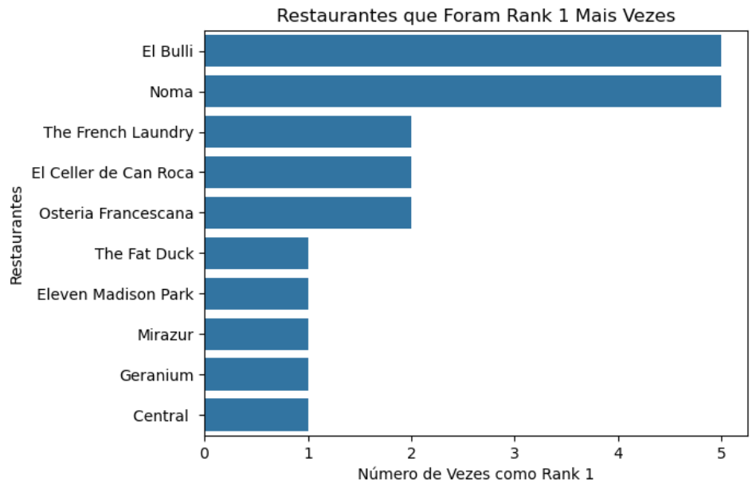
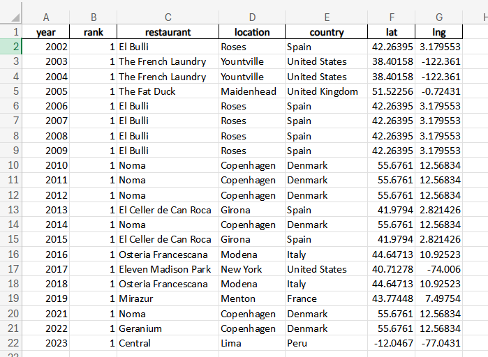

# Top 1 Restaurants Analysis

Este projeto analisa os melhores restaurantes do mundo ao longo dos anos.

## Dataset
Você pode acessar o dataset utilizado para esta análise [aqui](https://www.kaggle.com/datasets/thomasfranois/worlds-best-restaurants)

## Visualizações

### Gráfico dos Restaurantes que Mais Vezes Foram Top 1

### Visualização para Exportação do Excel

Nesta visualização, temos os restaurantes que ficaram no top 1 de 2002 até 2023, preparados para exportação e análise no 

## Conclusão e Insights

### Evolução dos Restaurantes no Top 1
Observando os dados de 2002 a 2023, notamos que certos restaurantes conseguem manter a excelência por anos consecutivos, enquanto outros são mais voláteis no ranking.

### Tendências Geográficas
Analisando a localização dos restaurantes que ficaram no top 1, percebe-se uma concentração em determinadas regiões ou países em certos períodos. Por exemplo, um aumento de restaurantes asiáticos nos últimos anos.

### Preferências Culinárias
A popularidade de certos tipos de culinária, como a molecular gastronomy, que teve seu auge em determinada década, pode ser observada.

### Impacto de Chefs Conhecidos
Restaurantes liderados por chefs renomados têm maior probabilidade de alcançar o top 1 várias vezes.

### Destaques
Restaurantes que conseguiram voltar ao topo após vários anos, indicando um possível rejuvenescimento da sua proposta culinária.

## Próximos Passos

### Conclusão
A análise mostra uma dinâmica interessante no mundo dos melhores restaurantes, com alguns mantendo uma posição dominante e outros subindo e descendo no ranking.

### Próximos Passos
Investigar mais a fundo as características específicas que levam um restaurante ao topo e explorar a correlação entre tendências globais e mudanças no 